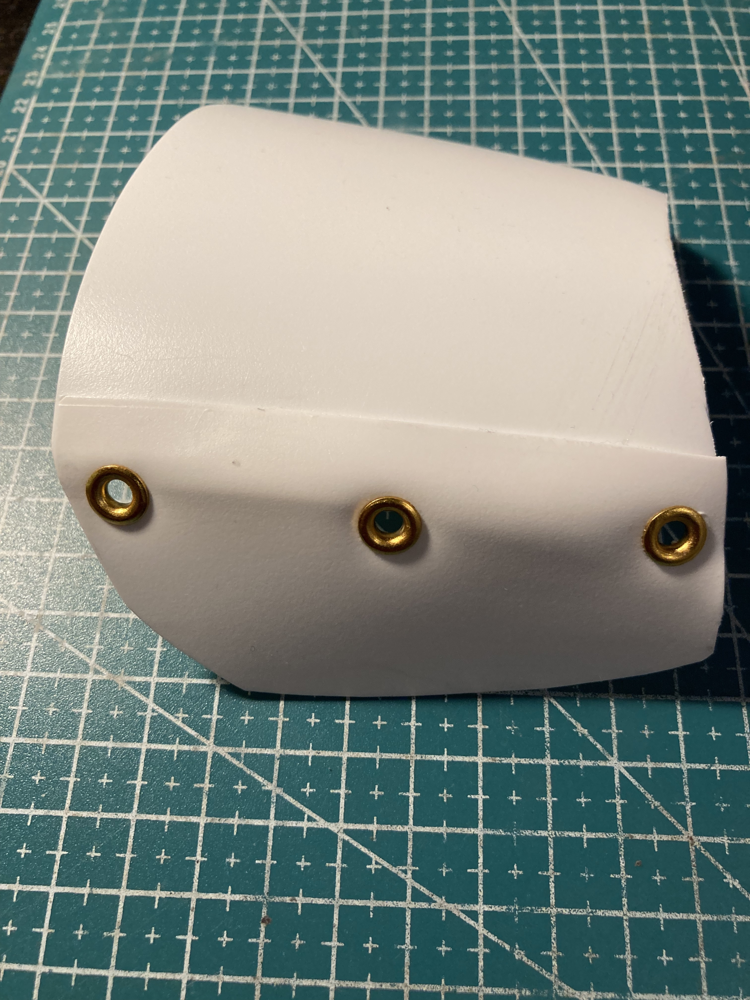

Description:
============

This project is about the construction of an inexpensive VR glove. It was the consequence of a bet with a friend,  involving the construction of a VR glove spending 20E or less (at that time, now thanks to inflation, components shortage and speculation the cost could rise a little bit. For that reason, I suggest you to search the parts on Aliexpress, where is still possible to buy a TTGO at reasonable price, you can also use an exp32 without display to save more money).

This project must be intended as a work in progress with plenty of space for improvements ( See the following section "Important Notes and Advises").

https://github.com/gbonacini/VR_Glove/blob/main/screenshoots/glove.mov

Some details:

* The construction doesn't involve the use of 3D printers, you only need components and materials easily available.

* The glove can track fingers, thumb, hand, forearm and arm movements.

* Providing an USB external battery, the glove could be used completely wireless, via bluetooth (SID: "GLOVE_ESP").

FEATURES:
=========

This device use 5 potentiometers to track fingers and thumb contractions and 3 accelerometers to track the movements of hand, forearm and arm.

Hardware Prerequisites:
=======================

* 1 X TTGO ESP32 ( you can use a regular ESP32 removing the display related parts in the code , but I recommend the TTGO because a display is useful for calibration and other menu based tests I'll add in future);
* 3 x MPU-6050 ;
* 1 x TCA9548A I2C Multiplexer ( optionally you could hack the address handling so that only a device has the selected address at given time);
* 5 x linear potentiometer ( I recycled mine from a broken stereo );
* 3 x tactile buttons;
* Veroboard ( pierced PCB board);
* Cable ties;
* Plastic sheet ( I recycled a shampoo bottle );
* A glove, thin metal sheet, screws, metallic wire ( I used plastic coated wire for gardening ), elastic bands, some 3 mm nuts and bolts, sheet metal stripes ( potentiometer supports ), belt (nylon belts, velcro, strings, etc ) to fix glove and arm/forearm sensors in place, hooked springs. I literally used / reused what I had in my storage room.

Construction:
=============

* I built custom finger position sensors using some old linear potentiometers from  broken stereo, trimming the cursor shafts and drilling an hole in that part to connect cable ties to fingers and thumb and the related return elastic belt:

* The potentiometers were soldered to stripes of Veroboard to fix them, using bolts, to the hand shell I made with some recycled plastic sheet;

* About the hand shell, I made it using two pieces of plastic from a shampoo bottle, attached together with rivets. You can use different connection techniques (i.e. bolts):

* At this point it's necessary to modify the glove adding the connection to the potentiometers, using cable ties:

* To fix that ties to the glove, two different techniques were employed. 

* First, I build some guides composed by two parts:
-  an external part made from the "heads" of the ties, removing the internal blocking tooth using an Exacto knife, so the ties connected to the potentiometer are free to slide. 
- a piece of flat stripe of tie with two holes corresponding to the two holes on the upper part of the guides. That stripes are positioned inside the glove and connected to the guide using an U-shaped piece of iron wire ( the green one ), like a stapler's rivet:

* The second technique permits to fix the strings to the finger / thumb tips. This is the point that transmits the movement to the corresponding potentiometer. I made those attachment points using some sewing rings, made of brass. I cut a little stripe, bending it to 90 degrees , drilling an hole used to fix the nylon string using a small piece of iron wire. Then I covered those parts using the finger tips of another glove for aesthetically reasons (it's optional) :

* Then I mounted the shell on the glove, the potentiometers ( using some metal sheet stripes with a pass-through bolt to fix the elastic band permitting the potentiometer cursor to return in position ). I used rivets and bolts :

* Then I installed the TTGO board support , the custom menu keypad ( made with 3 tactile switches ) and an accelerometer, as shown in the previous illustration;

* Last parts, the sensors holders for both arm and forearm, were made with some aluminum plates and cardboard rectangles as spacers, to permit the nylon belts to slide an to hide the heads of the bolts taking in place the components:

* Finally, the plates with the sensors were installed connected to the main board installed on the glove using flexible cables.

Firmware Installation:
======================

* The firmware, wrote in c++17, is intended to be compiled and installed using PlatformIO. See PlatformIO documentation for detailed instructions about the compiling and installation steps.

Calibration
===========

* Pushing LEFT + CENTER button, calibration menu is started, see instrunction on diplay, LEFT button to confirm;

Important Notes and Advises:
============================

* This device works but, at the moment, it's far to be ergonomically acceptable; Anyway, the reason to do prototypes is also to show errors and weak point in one design.
* I don't suggest fabric as glove material, it's too weak and it tends to rip off. In next versions, I'll use leather , composite material or other better options;
* The plates fixing the guides inside the glove are too thick, they produce too friction with the finger and are very annoying. Next version will employ different material, maybe steel sheet.
* The potentiometers I used are too long, not permitting to use the whole excursion space of the cursor. Next version will employ shorted potentiometer;
* Cabling and position of the parts must me rationalized. 

License:
========

[* This work is licensed under a Creative Commons Attribution-NonCommercial 4.0 International License](http://creativecommons.org/licenses/by-nc/4.0/)

* The following clause is added to the license: You must not to use the material to instruct AI / Machine learning systems.

Credits:
========

* Many thanks to A. Mercuri for the help me to test this device.
